# LAB 1
University: [ITMO University](https://itmo.ru/ru/)
Faculty: [FICT](https://fict.itmo.ru)
Course: [Network programming](https://github.com/itmo-ict-faculty/network-programming)
Year: 2024/2025
Group: K34202
Author: Subbota Anton Dmitrievich
Lab: Lab1
Date of create: 25.09.2024
Date of finished: 25.09.2024
## Цель 

Целью данной работы является развертывание виртуальной машины на базе платформы Microsoft Azure с установленной системой контроля конфигураций Ansible и установка CHR в VirtualBox

## Выполнение

1. Был установлен Python.

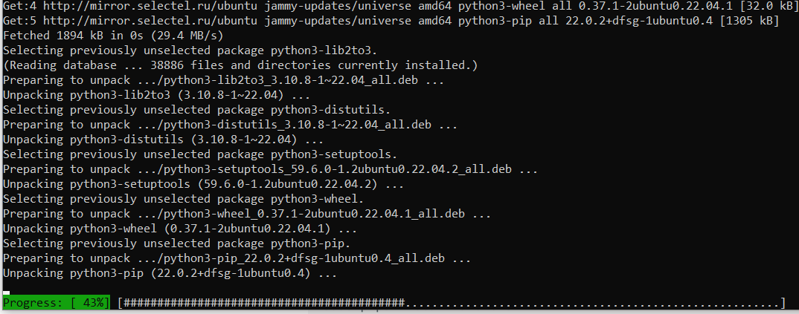

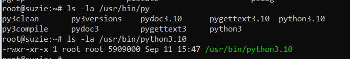

2. Был установлен ansible.

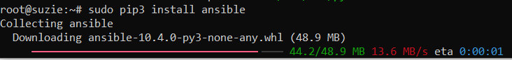

3. Была взята VDS в Selectel, в которой и будет установлен VPN сервер, а именно OpenVPN.

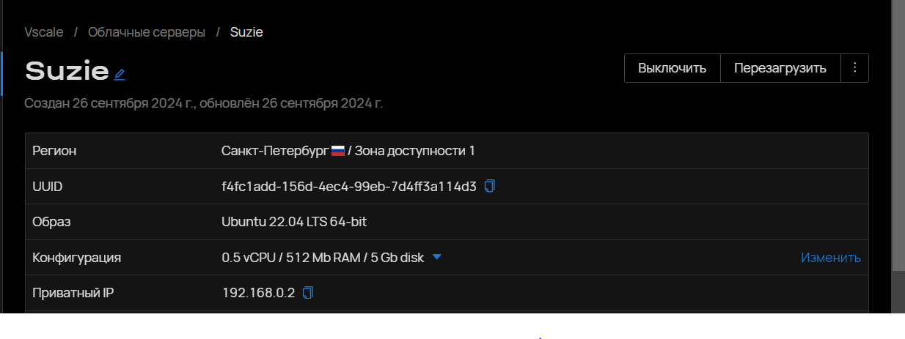

4. Был поднят OpenVPN сервер на VDS.

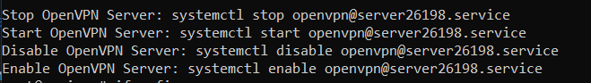

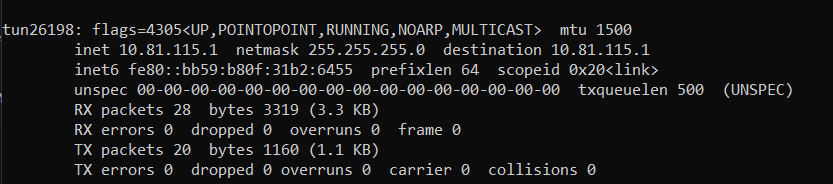

4.1. Был создан сертификат сервера.

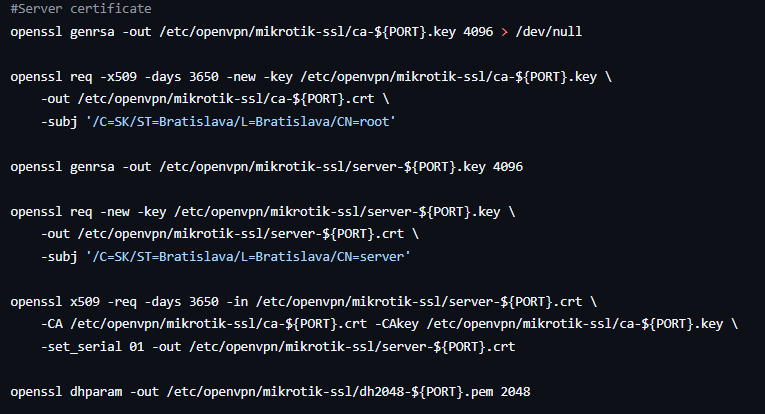

4.2. Был создан сертификат клиента.

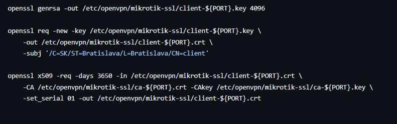

4.3. Создаем конфигурационный файл OpenVPN сервера.

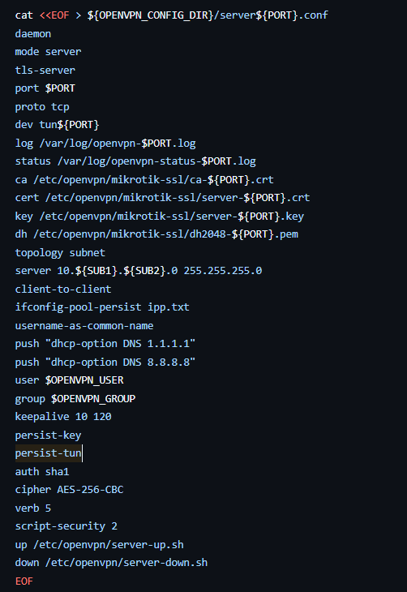

4.4. Настраиваем скрипты для сетевого окружения OpenVPN сервера.

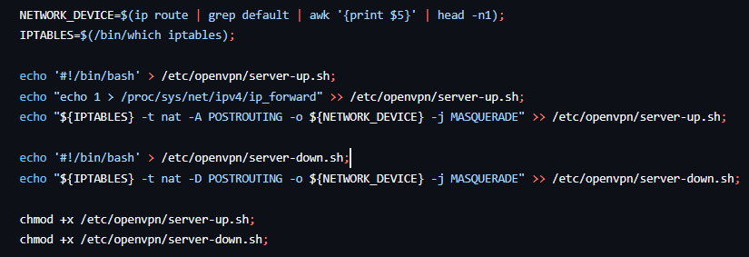

5. Сделаны сертификат и ключ, полученные при создании OpenVPN сервера.

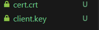

6. Была создана ВРМ c CHR на Virtualbox.

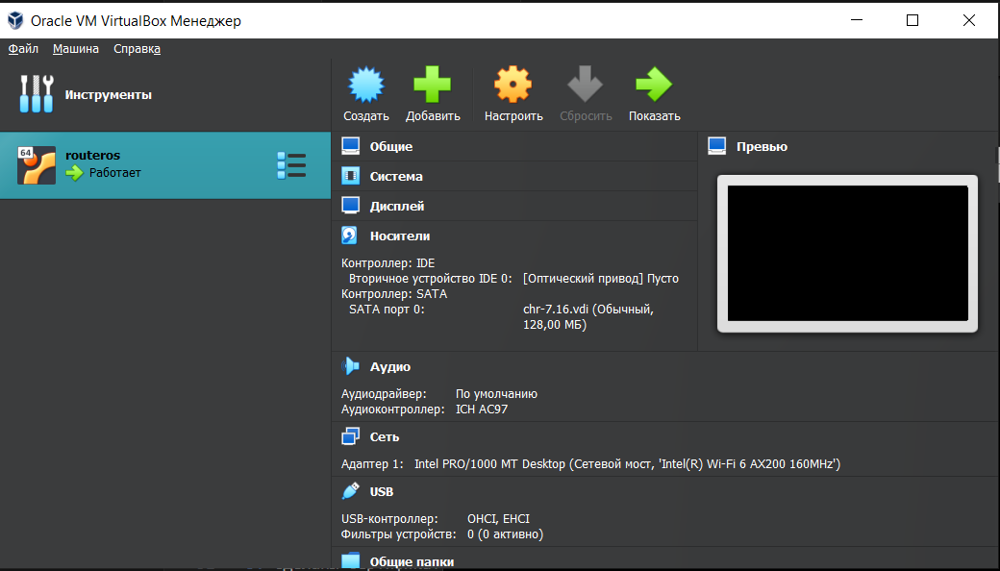

7. Были загружены сертификат и клиентский ключ на CHR.

8. Был создан туннель к OpenVPN с CHR.

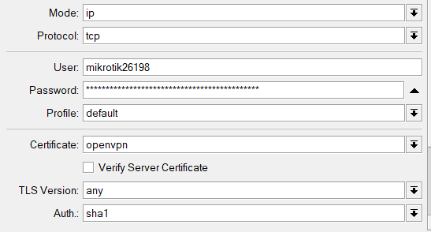

9. Клиент получил адрес от VPN сервера.

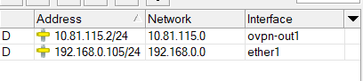

10. Была проверена работоспособность с сервера и клиента.

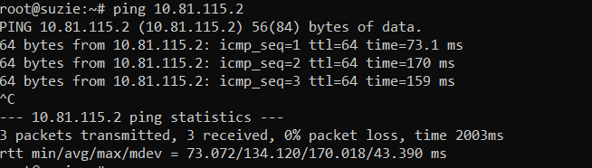

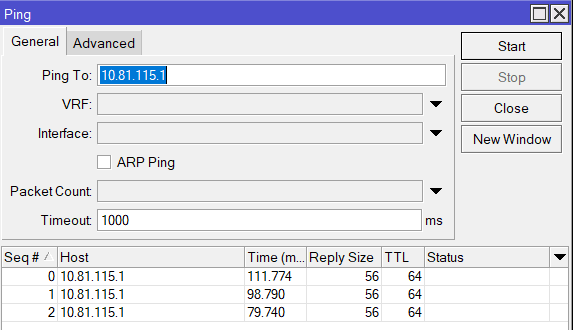

## Вывод

Была развернута виртуальная машина и установлена CHR, на базе Select VDS был установлен Ansible и поднят OpenVPN сервер. Между CHR и VDS настроен VPN туннель.
