# LAB 1

## Цель 

Целью данной работы является развертывание виртуальной машины на базе платформы Microsoft Azure с установленной системой контроля конфигураций Ansible и установка CHR в VirtualBox

## Задание 

Вам необходимо развернуть виртуальную машину с помощью Microsoft Azure в режиме студенческой подписки.
Если не получается в Microsoft Azure, можете выбрать любого бесплатного облачного провайдера

В бесплатном режиме Microsoft Azure предлагает для виртуальных машин только Ubuntu 16.4, нам нужна Ubuntu 18.+ поэтому необходимо обновить операционную систему. Сделать это можно с помощью данных команд:
sudo apt update & sudo apt upgrade
sudo do-release-upgrade
Теперь необходимо установить python3 и Ansible:
sudo apt install python3-pip
ls -la /usr/bin/python3.6
sudo pip3 install ansible
ansible --version
Далее вам необходимо на вашем компьютере установить VirtualBox а на него CHR (RouterOS).
В интернете есть инструкции по установке CHR на VirtualBox, одна из этих инструкций вам поможет.

После этого вам необходимо создать свой Wireguard/OpenVPN/L2TP сервер для организации VPN туннеля между вашим сервером автоматизации где был установлена система контроля конфигураций Ansible и вашим локальным CHR.
В интернете есть инструкции по установке Wireguard/OpenVPN/L2TP сервер для Ubuntu 18, одна из этих инструкций вам поможет.

После всех манипуляций вам необходимо будет поднять VPN туннель между вашим VPN сервером на Ubuntu 18 и VPN клиентом на RouterOS (CHR)
Что искать? («Название вашего протокола» клиент RouterOS).

## Выполнение

1. Был установлен Python.

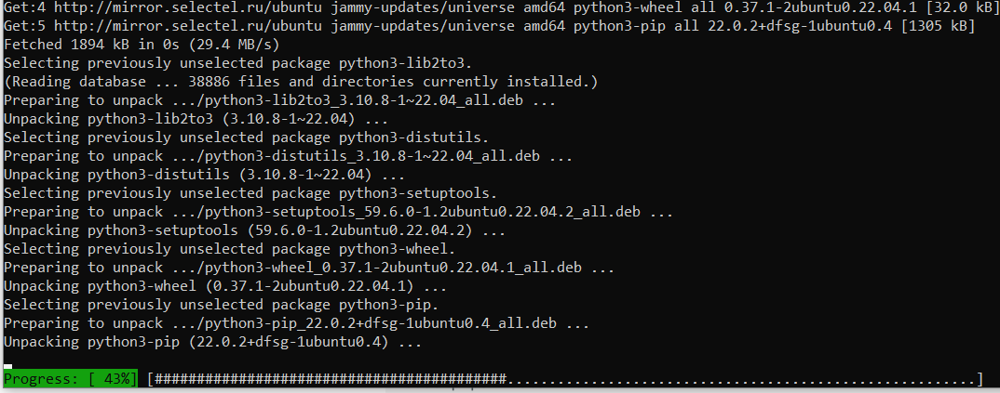

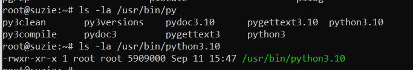

2. Был установлен ansible.

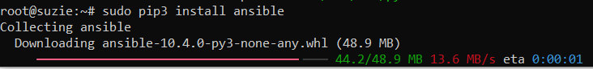

3. Была взята VDS в Selectel, в которой и будет установлен VPN сервер, а именно OpenVPN.

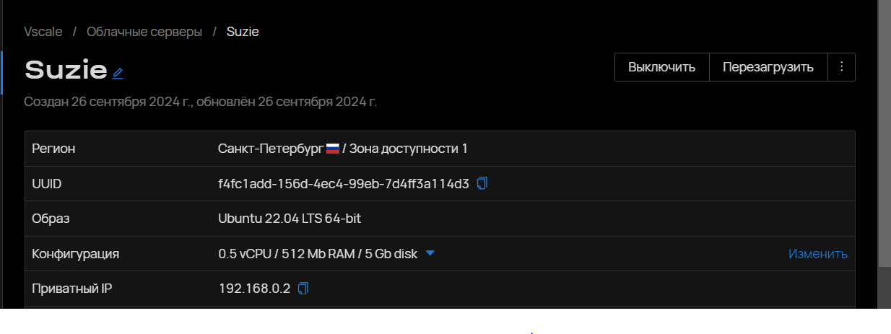

4. Был поднят OpenVPN сервер на VDS.

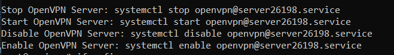

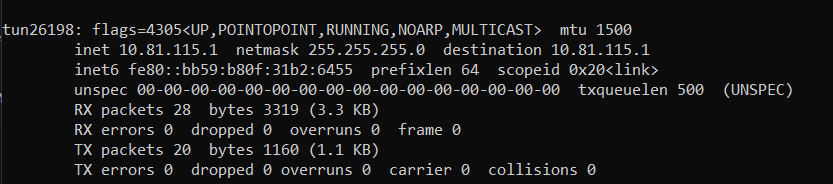

5. Сделаны сертификат и ключ, полученные при создании OpenVPN сервера.

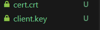

6. Была создана ВРМ c CHR на Virtualbox.

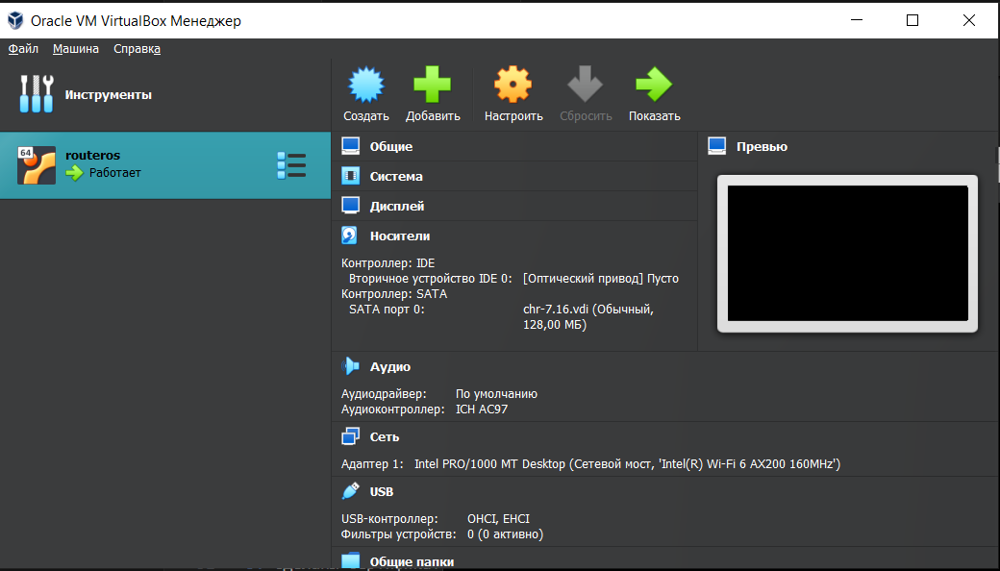

7. Были загружены сертификат и клиентский ключ на CHR.

8. Был создан туннель к OpenVPN с CHR.

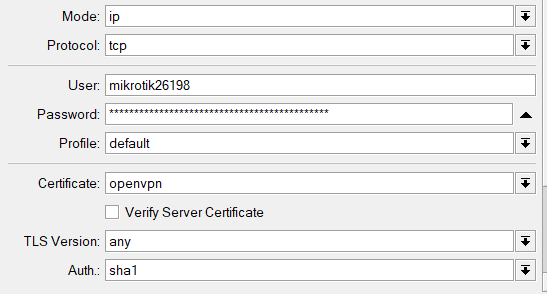

9. Клиент получил адрес от VPN сервера.

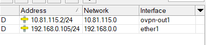

10. Была проверена работоспособность с сервера и клиента.

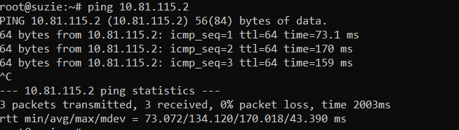

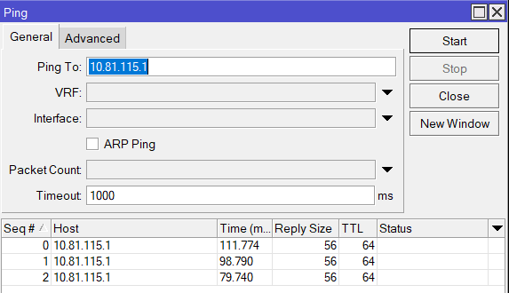

## Вывод

Была развернута виртуальная машина и установлена CHR, на базе Select VDS был установлен Ansible и поднят OpenVPN сервер. Между CHR и VDS настроен VPN туннель.
