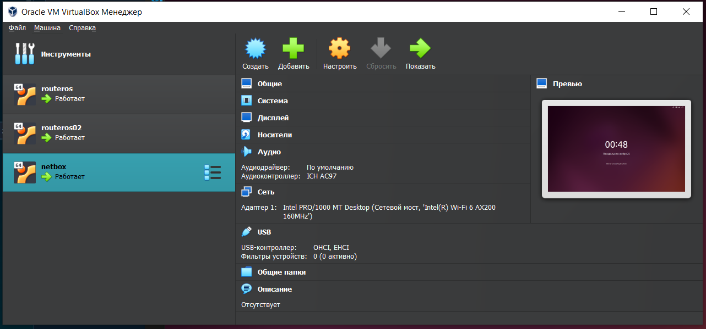
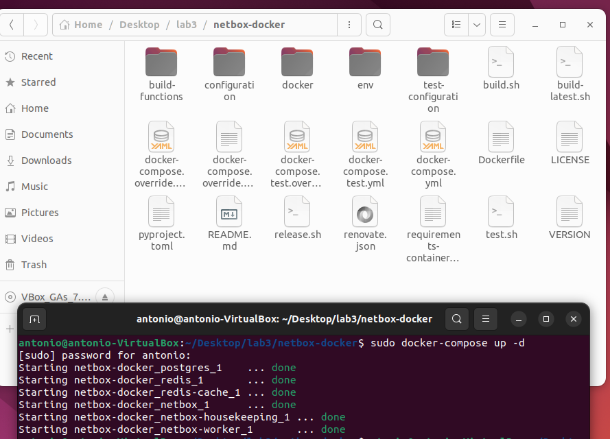
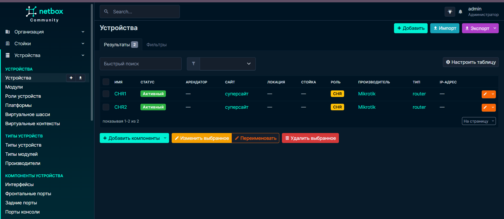
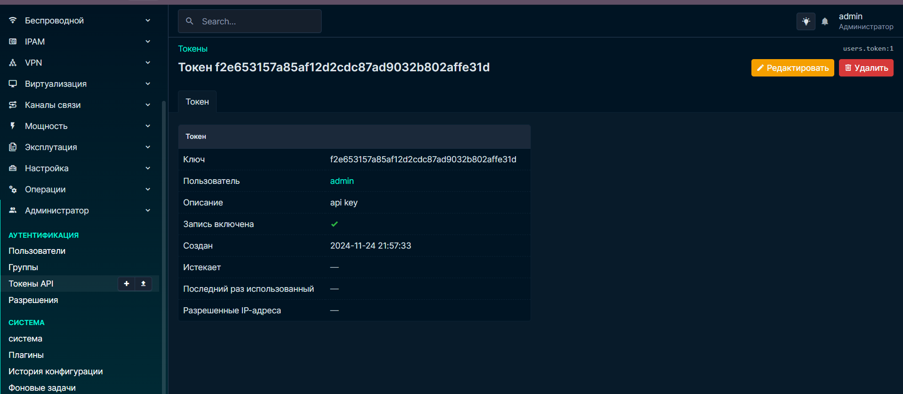

# LAB 3
University: [ITMO University](https://itmo.ru/ru/)
Faculty: [FICT](https://fict.itmo.ru)
Course: [Network programming](https://github.com/itmo-ict-faculty/network-programming)
Year: 2024/2025
Group: K34202
Author: Subbota Anton Dmitrievich
Lab: Lab2
Date of create: 18.10.2024
Date of finished: 18.10.2024

## Цель 

С помощью Ansible и Netbox собрать всю возможную информацию об устройствах и сохранить их в отдельном файле.

## Выполнение

1. Был развернут образ Ubuntu в Virtual Box

2. Был найден docker compose для netbox и соотвественно поднят netbox

3. В netbox была заполнена информация о двух маршритузаторах.

4. Был создан api key для ansible

5. 

